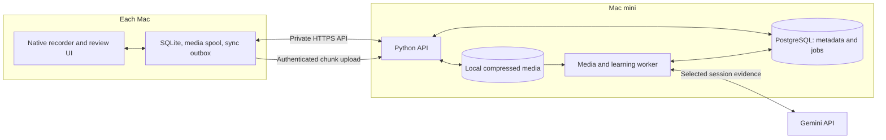

# ScholarsEye architecture proposal

Prepared September 15, 2026; updated with the user's MVP decisions. This document describes the target architecture. The native recorder is the current implementation milestone; backend processing and review features are planned. Performance budgets are targets until measured. References and price estimates below came from the initial architecture research and are not fresh validation of an implementation.

## Product contract

ScholarsEye should preserve useful learning with very little work after a session. Start recording, use ChatGPT, Cursor, a terminal, and mathematical tools normally, then stop. Later, answer a few focused questions by typing. Receive a checked answer and a concise explanation when needed; subsequent reviews adapt to recall.

The central product metric is **useful unaided recall per minute of review**. The number of generated cards is a cost, not a success metric.

Recordings show what was encountered, attempted, questioned, and corrected. They cannot establish exactly what a person learned. The pipeline must preserve that distinction, especially when an on-screen assistant confidently gives an incorrect answer.

Initial product decisions:

- Personal use across multiple Macs; account ownership included in the schema from the start.
- Native SwiftUI interface with AppKit where system integration requires it; macOS 15+ initially.
- One selected display, microphone, and optional system audio. Multiple displays come after profiling.
- Fully automatic activation of sufficiently verified problems. No mandatory post-session card-editing chore.
- No daily review-time budget or new-card admission cap in the MVP. Select a small, useful problem set based on evidence, quality, and duplication; a session can produce zero problems.
- Record at 1 fps by default, with a configurable frame-rate setting later. Continuous audio preserves the learner's spoken reasoning.
- Store recordings on the Mac mini. Compression, text readability, and limited local disk capacity are first-class constraints; cloud archive storage is out of scope initially.
- Detect likely idle intervals after recording, before expensive model analysis. Do not run live idle detection or automatically pause because of inactivity.
- Session summaries preserve broader context independently of the much smaller scheduled problem set.

## System shape



Use **Swift + SQLite** for clients, **Python + FastAPI + PostgreSQL** for the backend, and a **private local media directory on the Mac mini**. Use Python for the inference pipeline because media processing, validation, evaluation, and model SDK work fit naturally there. Keep API and worker in one backend codebase, run as separate processes. The first recorder runs entirely locally; add network transfer when introducing a second Mac.

Store video/audio files on the filesystem rather than as blobs in a relational database. PostgreSQL stores ownership, timestamps, relative media references, extracted evidence, questions, review history, and job state. Keep PostgreSQL on the mini initially. Separate media access behind a storage interface so a future hosting change does not alter capture or review logic. Cloudflare R2, cloud credentials, and a cloud archive are not prerequisites for any MVP milestone.

Use a PostgreSQL jobs table initially. Claim work in a short transaction using `FOR UPDATE SKIP LOCKED`, then release the transaction before media processing or model calls. PostgreSQL documents this locking option for queue-like consumers. [PostgreSQL SELECT documentation](https://www.postgresql.org/docs/current/sql-select.html)

## Native recording

### Capture path

Use ScreenCaptureKit. On macOS 15+, a stream can supply screen, system-audio, and microphone outputs. The first feasibility spike can use `SCRecordingOutput`; production capture should use stream sample outputs and `AVAssetWriter` for track separation and controlled file rotation. [Apple capture overview](https://developer.apple.com/videos/play/wwdc2024/10088/)

Start with:

| Setting | Proposed baseline |
| --- | --- |
| Screen rate | 1 frame/second default; tunable later |
| Resolution | Compare 2560-pixel-wide and native capture on real text/math |
| Color | SDR |
| Video codec | Prefer hardware HEVC when supported and validated; retain H.264 fallback |
| Microphone | Continuous AAC, initially 48 kHz mono, about 64 kbps |
| System audio | Optional separate track/asset; initially 64–96 kbps |
| Archive chunks | About 60 seconds, finalized independently |
| Capture queue | Initially three frames; all other queues bounded |

The current prototype uses hardware HEVC at a 2560-pixel width cap, 400 kbps nominal video target, microphone AAC at 24 kHz mono/48 kbps, and optional system audio AAC at 48 kHz stereo/96 kbps. These are starting settings, with actual measurements in [VALIDATION.md](VALIDATION.md). The prototype uses atomic JSON manifests rather than the planned SQLite upload outbox, and no server or review pipeline is installed yet.

Set `minimumFrameInterval` to one second. This limits update frequency; static screens do not necessarily produce a new image every second. Preserve elapsed time and the last visible frame through static periods. Fast scrolling or a briefly visible terminal result may be lost at 1 fps. Never accelerate the recording before sending it for analysis. [Frame interval](https://developer.apple.com/documentation/screencapturekit/scstreamconfiguration/minimumframeinterval), [idle frames](https://developer.apple.com/documentation/screencapturekit/scframestatus/idle)

Treat 1 fps as the chosen MVP default. Compare hardware HEVC and H.264 at that rate using real code, terminals, and mathematics. Measure total bytes/hour including audio, readable character detail, CPU, memory, energy, and seek/playback behavior. Prefer HEVC when it meets those requirements and materially reduces size. Any provider-specific conversion happens only for selected analysis windows after recording, without keeping an unnecessary second permanent copy of the session.

Preserve enough spatial detail to read code, subscripts, and equations. A recording can have very few frames and still need high resolution. The backend can inspect selected crops at greater detail, but it cannot recover text that the recorder discarded.

Pass pixel buffers to encoding without per-frame JPEG conversion or a continuously rendered preview. Keep transcription, OCR, and model inference off the capture path. Measure capture-related WindowServer and encoder work as well as app CPU. Apple's queue guidance favors small bounded queues; VideoToolbox exposes a property for checking whether hardware encoding is actually active. [Capture queue](https://developer.apple.com/documentation/screencapturekit/scstreamconfiguration/queuedepth), [hardware encoder status](https://developer.apple.com/documentation/videotoolbox/kvtcompressionpropertykey_usinghardwareacceleratedvideoencoder)

Keep microphone and system audio attributable. The learner speaking, a lecture playing, and ChatGPT speaking are different sources of evidence. Avoid treating speaker echo recorded by the microphone as a second learner statement. Map source timestamps to one monotonic session timeline; persist the mapping to wall-clock UTC. Test audio-device changes and drift rather than using callback arrival times.

### Durability and uploads

Keep one capture stream alive while rotating writers. Finalize a chunk, atomically rename it from a temporary filename, then transactionally mark it ready in SQLite. Each asset has a session ID, sequence, stream identity, start/end offsets, format, byte size, and SHA-256 hash. Record gaps and paused intervals explicitly.

Static screens need special handling at rotation: start the next video chunk from the cached last valid image, timestamped at its new boundary, and preserve the final image's duration through the chunk end. Otherwise an idle screen can produce an audio-only chunk with no independently decodable visual context. Before the first valid captured image, mark visual evidence as missing rather than inventing it. Verify this behavior in both local playback and provider input.

Use fragmented recording where the selected container supports recovery; validate interrupted-file recovery empirically. Even if active-fragment recovery fails, completed chunks should survive, bounding ordinary crash loss to the current chunk. [AVAssetWriter fragment interval](https://developer.apple.com/documentation/avfoundation/avassetwriter/moviefragmentinterval)

On the mini, commit completed chunks directly to the local media directory. When a second Mac is added, upload finalized chunks at low priority through the authenticated API, with a persistent outbox, idempotency keys, and retry backoff. Stream uploads into bounded temporary files; enforce declared size and quota, verify the content hash, then atomically rename into their final location and commit the asset record. Derive paths from server-owned identifiers, never client-provided filesystem paths. An interrupted upload remains incomplete and cannot enter processing. No presigned URLs or object-store credentials are involved.

Stopping recording closes the last chunk and freezes the expected manifest. Processing starts when that manifest and all expected assets are present and verified. A crash-recovered session can be explicitly finalized as incomplete, with its gaps visible.

Bound local storage and preserve a free-disk reserve; an initial target is 10 GiB, to validate against the mini's available space. Check capacity before capture and while writing. On a secondary Mac, separately bound pending uploads, initially targeting 5 GiB. If capacity becomes unsafe, stop or pause capture visibly after finalizing recoverable work. Never silently delete recordings. The MVP has no automatic raw-media expiry, deletion, or eviction, including after successful processing; provide explicit user-controlled deletion with clear consequences. Show actual storage usage and an estimate of remaining recording time based on observed bytes/hour. With the mini offline, secondary Macs record locally until their bound is reached.

### Recording controls

Provide a menu-bar indicator, Start/Pause/Stop shortcut, display selection, microphone level check, elapsed time, and explicit interrupted-recording state. Request screen and microphone permissions when setting up capture. Pause on session lock/sleep by default, then require an explicit resume after unlocking; preserve that gap in the manifest. [Apple media permission requirements](https://developer.apple.com/documentation/bundleresources/requesting-authorization-for-media-capture-on-macos)

Do not run idle detection during recording. After stopping, cheaply inspect audio energy/voice activity and visual changes to identify long likely breaks before model submission. A static screen is not sufficient evidence of absence: reading, thinking, and listening remain valid learning. Use conservative thresholds, retain context on both sides of a break, and preserve source timestamps in an explicit inclusion/exclusion map. Exclude high-confidence idle intervals from model inputs without deleting the original footage. Ambiguous intervals remain eligible for analysis. Evaluate missed learning and token savings using realistic breaks.

## Turning sessions into problems

Use a durable pipeline with explicit stages:

`awaiting_assets → ready → preparing → extracting → consolidating → validating → published`

Failures carry a retryable/permanent classification and a user-readable cause. A completed stage writes its artifacts and subsequent job atomically. Jobs have leases, heartbeats, retry counts, exponential backoff, and unique stage/input/version keys. A crashed worker releases work through lease expiry. Retrying must not publish duplicate problems; provider requests themselves may still incur duplicate charges after uncertain timeouts.

1. **Prepare evidence.** Run cheap post-recording idle analysis first. Exclude only high-confidence breaks from expensive inference, retaining the source files and interval map. Reconstruct synchronized analysis windows of about ten minutes with 20–30 seconds of overlap around the remaining material. Archive chunks and analysis windows have different purposes. Keep original session offsets and separate audio-source identity; do not splice across removed time without a mapping. Prototype the provider packaging rather than assuming every audio track in an MP4 is read.
2. **Extract observations.** Require structured concepts, learner questions, attempted work, visible code/math, mistakes, corrections, and unresolved issues. Every observation references actual source intervals and identifies whether it came from the learner, another speaker, or visible text.
3. **Resolve unreadable or uncertain details.** Inspect relevant source crops or short clips. Timestamp references must exist within supplied assets. Unreadable evidence remains uncertain.
4. **Consolidate.** Merge overlapping observations, resolve corrections across windows, and compare against existing learning objectives/questions. Repeated evidence should strengthen an existing concept instead of creating repeated cards. Start with SQL search plus model comparison of a bounded candidate set; add embeddings only when measured retrieval needs them.
5. **Select.** Rank reusable ideas, demonstrated misconceptions, prerequisite value, and novelty. Time spent on screen is only one signal; it does not prove difficulty. Keep the question set concise through quality and deduplication, without adding daily time budgets or new-card admission caps to the MVP.
6. **Generate.** Produce a self-contained question, typed answer specification, canonical solution, alternatives, concise explanation, source links, and estimated response time.
7. **Validate.** Separately check source support, answer correctness, ambiguity, answerability without the original recording, and duplication. Use deterministic checks where possible and an independent verification pass otherwise. Model agreement alone is not proof. Reject or hold uncertain candidates.
8. **Publish.** Activate the accepted subset automatically. Keep an optional session summary and inspection view, without requiring the user to clean up every rejected candidate.

Initially use `gemini-3.8-flash` behind a small model-provider interface. Google's current documentation lists it as stable with video/audio input and structured output. Pin model identifiers and record model, prompt, schema, and validator versions for every run. [Model documentation](https://ai.google.dev/gemini-api/docs/models/gemini-3.8-flash)

Start with explicit static video windows for predictable coverage. Google's API defaults to 1 fps; higher media resolution helps with small text. Benchmark selective/agentic video analysis later against the same labeled sessions, including missed mistakes, rather than assuming advertised token savings preserve every useful detail. [Video understanding](https://ai.google.dev/gemini-api/docs/video-understanding)

Recordings and model responses are untrusted data. Visible webpages, prompts, code comments, and terminal output must never become worker instructions. Extraction/validation requests get no shell, account-changing, or unrestricted network tools. Parse results through schemas with size and range limits.

## Answering and scheduling

Keep **grading** separate from **scheduling**. Grading determines whether an answer satisfies a fixed specification. Scheduling uses recall outcomes and review history to choose the next due time.

| Problem type | Initial grading approach |
| --- | --- |
| Short answer | Explicit normalization and approved aliases |
| Number | Numeric parser, tolerances, and specified units |
| Code output | Checked expected output and narrow formatting rules |
| Brief explanation | Versioned rubric and semantic grader; uncertainty is a distinct result |
| Symbolic mathematics | Later: restricted expression parser and domain-aware equivalence |
| Small programming task | Later: tested contract inside a disposable isolated execution environment |

Do not apply blanket lowercasing to case-sensitive answers. Do not use unrestricted `eval` for math or execute generated/submitted code on the master Mac. General proof grading and arbitrary coding assignments stay outside the first version.

For example, a session struggling with Python closure capture might yield: “What does `[f() for f in [lambda: i for i in range(3)]]` return?” The reference is `[2, 2, 2]`, with a brief explanation that each closure reads the same final binding. A later transfer problem can ask how binding a default argument changes the result. Those are separate assessed skills rather than silently changing an existing card's difficulty.

Use **FSRS** with a proposed initial 90% desired retention. Correct unassisted answers map to `Good`; incorrect answers or revealing the solution map to `Again`. Let the scheduler compute intervals. Store hints, correctness, latency, and confidence separately; typing speed should not automatically mean easy or hard. [FSRS Python implementation](https://github.com/open-spaced-repetition/py-fsrs), [FSRS rating guidance](https://github.com/open-spaced-repetition/fsrs4anki/blob/main/docs/tutorial.md)

After failure, show the reference answer, a concise explanation, and an optional source clip. Revisit after intervening problems or a short configured relearning step. Immediate copying of a revealed answer is practice, not fresh evidence of unaided recall.

Provide “I was right,” “bad question,” and “skip.” A network failure or uncertain semantic grade must not count as forgetting. Offline, constrained questions can grade locally; explanation questions fall back to an explicit self-assessment against the reference, or wait for grading.

Show due problems without a daily time budget or new-item admission cap. Do not falsify due dates to make an overdue queue disappear. Repeated failures should trigger investigation of a bad question or missing prerequisite. Offer suspension or a clearer prerequisite problem.

Pin FSRS algorithm, parameters, learning/relearning rules, scheduler implementation versions, and deterministic randomness policy. Swift and Python implementations must pass the same history fixtures before offline scheduling ships. A Swift implementation is available, but package defaults must not be assumed equivalent. [Swift FSRS](https://github.com/open-spaced-repetition/swift-fsrs)

## Data model and sync

Use UUIDs generated by clients where offline creation is needed. Every server-owned record has an account owner, and access is checked on every endpoint.

| Entity | Important contents |
| --- | --- |
| accounts / devices | Owner, device identity, revocable token hash, last sync |
| sessions | Device, start/end, monotonic timeline mapping, status, manifest version |
| media_assets | Session, source track, sequence, relative local storage key, offsets, size, hash, verification |
| pipeline_jobs / runs | Stage, lease, attempts, input hash, versions, cost, failure |
| observations | Typed learning evidence, source ranges, confidence, provenance |
| learning_objectives | Stable concept identity and supporting observations |
| items / item_revisions | Stable scheduled item plus immutable prompt/answer/rubric revisions |
| scheduler_configs | Algorithm version, parameters, retention, learning policy |
| review_events | Attempt identity, item_revision_id, scheduler_config_id, device sequence, answer, occurrence time, predecessor, exposure |
| grading_events / corrections | Verdict, method/model, rubric version, override, replacement linkage |
| card_states | Rebuildable schedule projection, due time, stability, difficulty, revision |
| sync_changes / tombstones | Ordered change cursor and deletions for device reconciliation |

Clients keep cached problems, schedules, local media manifests, and a transactional outbox in SQLite. Saving an answer, its event, and the outbox row is atomic. Push changes with idempotency keys; pull server changes by cursor. Store timestamps in UTC and show them in the user's local timezone.

Pin the item revision, grading specification, and scheduler configuration when the prompt is shown. Delayed grading and offline synchronization must evaluate the answer against that same revision, even if a newer question has since been generated.

The mini owns the canonical review history and schedule. Clients may compute provisional schedules offline. Never merge two stability values using last-write-wins.

For initial conflict handling, each attempt identifies its prior schedule event and local causal predecessor. A valid causal chain advances the schedule once per accepted recall attempt. If two devices independently answer from the same predecessor, the first valid chain accepted by the server is scheduling-authoritative; competing stale-branch attempts remain recorded as extra practice and receive the canonical state on sync. This conservative policy may undercount genuine offline reviews, but avoids inventing multiple independent memory measurements from concurrent exposure. Version the policy, retain credible occurrence times and clock-offset evidence, and revisit it with actual usage. Never sort all reviews solely by upload time.

Corrections are append-only and rebuild affected projections. Cosmetic item changes preserve identity; a materially changed learning objective gets a new item. Tombstones prevent offline devices from resurrecting deleted records; expired offline clients perform a full resync. Explicit user deletion rejects new asset uploads and finalization. In-flight uploads recheck session state before committing; workers recheck deletion transactionally before publishing. Cleanup removes abandoned temporary files and user-deleted media without treating completed raw recordings as disposable.

Minimum API surface:

```text
POST /v1/devices/pair                    One-time local pairing, then revocable device credentials
POST /v1/sessions                        Idempotent session creation
PUT  /v1/sessions/{id}/assets/{asset_id} Authenticated, idempotent, verified local-file upload
POST /v1/sessions/{id}/finalize           Immutable expected manifest
GET  /v1/sessions/{id}                    Processing status and summary
GET  /v1/sessions/{id}/assets/{asset_id} Authenticated evidence playback/download
POST /v1/reviews                         Idempotent attempt ingestion/grading request
POST /v1/review-corrections               Explicit grade overrides
POST /v1/sync                            Push events, pull changes and canonical projections
DELETE /v1/sessions/{id}                 Tombstone plus asynchronous media/derivative cleanup
GET  /health                            Process health; readiness checks kept separate
```

## Mac mini operations and privacy

The initial environment inspection found an **M4 Mac mini, 16 GB RAM, macOS 26.2**, with roughly **38 GiB available disk space** at that time. Tailscale was installed. The selected developer directory was Command Line Tools; Xcode was not found at `/Applications/Xcode.app`. Recheck capacity and tool availability during implementation rather than assuming these observations remain current.

This hardware is a reasonable starting host for a personal API, small PostgreSQL database, and bounded worker using remote inference. That is a sizing judgment, not a completed load test. Begin with one media preparation job and at most two concurrent model requests; measure contention while the mini is also used for learning. Avoid loading a large local model alongside capture in the first version.

Run the API, worker, and PostgreSQL as supervised native services with `launchd`. Keep an interactive development mode. Bind API and database to loopback; expose the API through Tailscale Serve with private HTTPS and restricted tailnet access. Also require application device credentials. Tailscale Serve can route tailnet traffic to a local service without making it publicly accessible. [Tailscale Serve](https://tailscale.com/docs/features/tailscale-serve)

Plan for the mini being asleep, offline, rebooting, or awaiting login after FileVault unlock. Existing cached reviews and bounded local capture continue; new processing and synchronization wait. Server setup should deliberately configure power/restart behavior and test it. No router port forwarding is needed for this design.

Keep API keys in the mini's Keychain or protected service configuration and device credentials in client Keychains. Use restricted local media-directory permissions, encrypted local volumes, and authenticated API access for remote media playback. Keep media out of public web roots and source control. Because remote models process selected recordings, local archival storage does not mean that inference stays on-device.

Use a billing-enabled paid model project for personal recordings. Google's paid-service terms exclude submitted content from product improvement, but that does not mean zero provider retention. [Gemini API terms](https://ai.google.dev/gemini-api/terms)

For the current Interactions API, explicitly set `store=false`; use streaming requests and the app's durable queue because this setting cannot be combined with provider background execution. [Interactions API](https://ai.google.dev/gemini-api/docs/interactions-overview)

Inference uploads are temporary: the Files API documents 48-hour expiry, a 2 GB/file maximum, and 20 GB/project storage. Delete these copies after their last processing use, with a cleanup job for abandoned attempts. They are separate from the private archive. [Files API](https://ai.google.dev/gemini-api/docs/files)

Retain raw recordings on the mini until the user explicitly deletes them. No automatic 30-day expiry or irreversible raw-media cleanup is part of the MVP. Show disk consumption and keep recording capacity limits visible. Explicit session deletion removes raw media, snippets, transcripts, observations, and associated generated items by default, cancels pending jobs, and records tombstones. If a concept has other sources, remove only the deleted provenance and revalidate it. Explain any configured backup-expiry behavior in the product. Logs contain identifiers, timings, and errors rather than screenshots, transcripts, answers, or credentials.

Plan encrypted PostgreSQL backups to a user-selected separate local/external destination; cloud backups are optional later. Keep keys recoverable outside the mini and test a restore onto a fresh database. Initial recovery-point target: at most 24 hours of server metadata, with unsynced client events retained until acknowledged. A backup on the same disk is not protection against disk failure, and a metadata backup does not preserve the recordings; make the configured coverage explicit. Do not claim backup durability until a separate destination and restore have been validated.

Moving to a hosted API/worker and managed PostgreSQL should require endpoint/secret changes and a database migration, not replacing capture or review logic. Public multi-user launch also requires managed account authentication, tenancy tests, abuse limits, and stronger availability guarantees.

## Resource and cost budgets

Initial recorder goals, to validate on this mini: steady-state app CPU averaging no more than roughly 5% of one core, memory below 250 MiB without growth over two hours, and low system energy impact. These are engineering targets, not guarantees. Audio continuity, text readability, and bounded storage take precedence over an arbitrary bitrate.

For illustrative storage arithmetic, a 0.3–1.0 Mbps video average plus one 64 kbps audio track is about **0.16–0.48 GB/hour** in decimal units. A second audio track adds to this. These assumed bitrates are not measured and detailed screens may require more. Sixty retained recording hours would occupy roughly 10–29 GB before snippets, temporary processing files, and other data. With limited free disk, measured compression is a release criterion, not a later optimization.

Measure bytes/hour for static reading, coding, scrolling, video playback, silence, and sustained speech. Bound temporary preparation space, process one window at a time, and clean up regenerable derivatives after use. Retain the original compressed recording until explicit deletion. No cloud-storage cost or service is required in this design.

Google's approximate static video accounting gives these illustrative single-pass input costs:

| Processing | Input tokens/hour | 3.8 Flash input cost/hour through Dec 2026 |
| --- | --- | --- |
| Low media resolution | About 360,000 | About $0.27 |
| High media resolution, across smaller windows | About 1,080,000 | About $0.81 |

These calculations use $0.75/million input tokens. Output including thinking is $3.75/million; both published rates double January 1, 2027. Overlap, separate audio analysis, crops, validation, grading, retries, and other services are additional. Ten thousand output/thinking tokens adds about $0.038 at current rates. [Video token accounting](https://ai.google.dev/gemini-api/docs/video-understanding), [Gemini pricing](https://ai.google.dev/gemini-api/docs/pricing)

Log actual usage per session and enforce a configurable daily/monthly processing budget. Before spending above a cap, queue the job and show why it is waiting. Compression saves storage and network; API inference cost also depends on duration, sampled frames, media resolution, and analysis work.

## Evaluation before expansion

Every user-facing change must pass computer-use validation through a realistic journey in the native app. Launch the built app, complete permission onboarding, start recording, switch through learning tasks, speak continuously and take a break, stop, inspect the saved session, and replay relevant screen/audio evidence. For later features, continue through processing, typed answers, corrections, due dates, restart, and offline recovery. Include changed failure states rather than only the happy path. Record what was actually exercised and distinguish untested scenarios from passing checks.

Pair UI validation with artifact checks: media codec, dimensions, frame timing, duration, audio presence and synchronization, chunk continuity, manifest integrity, playable finalized files, and storage totals. Measure CPU, memory, energy, and bytes/hour during representative capture. Compilation and unit checks support this evidence but cannot substitute for computer use. Do not claim a two-hour endurance test, permission flow, recovery behavior, or model pipeline is verified until it has actually run.

Build a small private benchmark from real coding, mathematics, and ChatGPT sessions. Annotate the important concepts and mistakes once for development. Measure evidence coverage, unsupported claims, incorrect solutions, grading false negatives, user deletions/overrides, daily review time, and delayed unaided recall after one week and one month.

For the first release, the hard gates are reliable capture, answer correctness, traceable evidence, recoverable failures, and a review workload the user actually completes. Fancy dashboards, a knowledge graph, local large-model inference, arbitrary code execution, and elaborate multi-agent generation should wait until this loop works.
